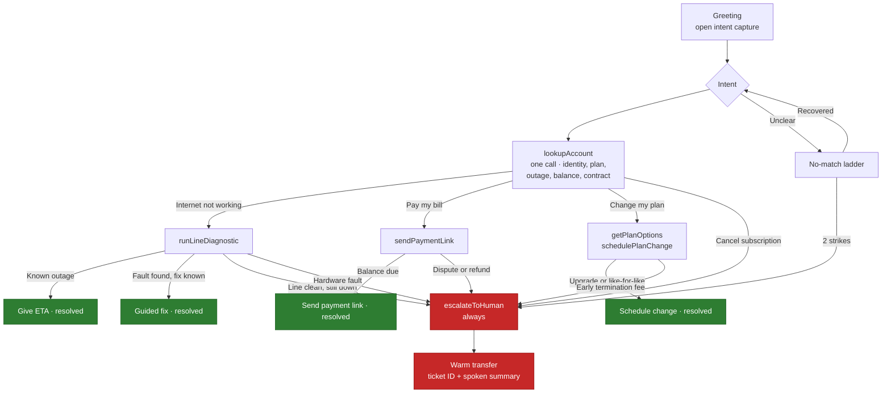

# Conversation Design — BrightConnect Voicebot

**Deliverable 3 of 4** · Agent persona: **Ava**, BrightConnect customer care

This document contains the sample conversation flows the exercise asks for, annotated with the
reasoning behind each design decision. The annotations are the point: any tool can generate a
plausible-sounding script, but the value of a conversation designer is in knowing *why* a line is
worded the way it is and what it costs when you get it wrong.

---

## 1. Design principles

Six rules govern every line Ava speaks. They are enforced in the system prompt
(`../assistant/prompt.md`) and referenced throughout the annotations below.

| # | Principle | Why it matters on voice specifically |
|---|---|---|
| 1 | **One question per turn** | A caller can hold one open slot in working memory. Two questions in one breath means they answer the last one and you have lost the first. |
| 2 | **Acknowledge before acting** | The caller has told you something costly (no internet, a bill they can't pay). Moving straight to process reads as indifference. One clause is enough — more is padding. |
| 3 | **Read back anything that gates a lookup** | Digit strings are where ASR fails most. A misheard account number sends the whole call down the wrong path, and the caller finds out three turns later. |
| 4 | **Narrate every wait** | Silence on a phone line means "the call dropped", not "the system is thinking". Every tool call is covered by a spoken filler. |
| 5 | **Name the reason for a transfer** | Never make a caller ask "why are you sending me somewhere else?". State the reason, then transfer. |
| 6 | **Never invent, never over-promise** | No fabricated account data, no guessed engineer arrival times. Voice makes invented specifics sound authoritative, which makes them more damaging than in text. |

**Writing for the ear, not the page.** No bullet lists read aloud. No sentences that need punctuation
to parse. Contractions throughout. Target 15–25 words per turn — long enough to sound human, short
enough that barge-in never costs the caller anything important.

---

## 2. Primary flow — "My internet is not working" (ends in escalation)

Eight lines across the call, escalating on the third caller reply. This flow was chosen as primary
because it exercises the full range: automated diagnosis, a genuine attempt at self-service
resolution, and a clean escalation when the bot correctly determines it cannot fix the problem.

---

**① Ava:** "Hi, thanks for calling BrightConnect. I'm Ava. What can I help you with today?"

> **Open intent capture, not a menu.** A menu ("press one for billing…") front-loads the caller with
> options they must map their problem onto. An open prompt lets them describe the problem in their
> own words, which is the one thing an LLM handles better than a DTMF tree — so use it. Ava names
> herself once and never again.

---

**② Caller:** "My internet's not working. It's been out since last night and I've got a work call in an hour."

> Note the caller volunteered a **stake** ("work call in an hour") alongside the problem. Most scripts
> discard this. Ava uses it in the next turn and again at escalation. Callers notice when you were
> listening.

---

**③ Ava:** "Sorry — that's bad timing. Let's get it sorted. Can I take the phone number on your account?"

> **Acknowledge (one clause), commit, then ask one thing.** "That's bad timing" beats "I'm sorry to
> hear that" because it references *their* specific stake rather than the generic fact of a fault.
>
> **Phone number, not account number.** This is the most consequential decision in the flow. People
> know their phone number by heart; account numbers require finding a bill. Asking for something the
> caller can't answer at the first slot is how calls die before they start. Ava accepts an account
> number too if that's what they offer — but she asks for the easy one.

---

**④ Caller:** "Yeah, it's four one five, five five five, oh one double six."

> Real speech, not the clean input a demo script would use — "oh" for zero, "double six" for two
> sixes. Deepgram's `smartFormat` plus keyterm boosting handles this; the flow is designed assuming
> callers speak like people. Turn ⑤ verifies rather than trusts.

---

**⑤ Ava:** "Got it — 415-555-0166. Give me one second while I check the line."
> *[calls `lookupAccount` → Sarah, Fiber 500, no area outage, balance current]*
> *[calls `runLineDiagnostic` → sync OK, signal healthy to premises]*

> **Read back, then act.** Two seconds spent confirming digits prevents the failure mode where the
> bot cheerfully reports on the wrong account and nobody notices for three turns.
>
> "Give me one second" is the tool's `request-start` filler, spoken the instant the tool fires. It
> covers the 300–800ms webhook round trip and sets a duration expectation. Without it the caller
> hears dead air and says "hello? hello?" — which then arrives as input and derails the turn.
>
> **One lookup, all four intents.** `lookupAccount` returns identity, plan, outage status, balance and
> contract state in a single response, so no intent needs a second identification round trip — a
> billing call and a fault call both proceed straight from here. Only `runLineDiagnostic`, which is a
> genuinely slow line test, is a separate call, and it fires only for the fault path.

---

**⑥ Ava:** "Okay — there's no outage in your area, and the line looks healthy right up to your building. So it's likely the router itself. Have you tried unplugging it for thirty seconds and plugging it back in?"

> **Report the finding before the ask.** The caller now understands *why* they're being asked to
> reboot, which is the difference between collaboration and being fobbed off with the oldest trick in
> support. Ava earned the right to ask by doing the diagnostic first.
>
> Ends on a closed question — after an informative statement, a yes/no keeps the turn tight.

---

**⑦ Caller:** "Yeah, I've done that twice. Three times, actually. Nothing."

> **The escalation trigger fires here.** Line diagnostic clean + power cycle already attempted =
> hardware fault. Ava's instructions say to escalate rather than work down a longer troubleshooting
> tree, because everything left on that tree is something this caller has already ruled out.

---

**⑧ Ava:** "Then it's not something I can fix from here. The line's fine but the router isn't, and that's a hardware swap. I'm putting you through to our technical team now — they can sort a replacement and talk you through options for today. Your reference is B-C-4-4-7-1, and they'll already have everything we've been through, so you won't need to repeat yourself."
> *[calls `escalateToHuman` → ticket BC-4471, then `transferCall`]*

> Four things happen in this turn, in this order, and the order matters:
>
> 1. **State the limit plainly.** "Not something I can fix from here" — no hedging, no apology spiral.
> 2. **Give the reason.** Line fine, router isn't, hardware swap. The caller can now explain their own
>    problem to the next person, which is worth more than any ticket note.
> 3. **Set expectations honestly.** "Options for today" — *not* "an engineer will be there before your
>    call". Ava has no idea when an engineer is available, and inventing that is a broken promise with
>    a timestamp on it. This is principle 6 doing real work: the caller's stated stake creates
>    pressure to over-promise, and the design explicitly resists it.
> 4. **Remove the repetition fear.** "You won't need to repeat yourself" addresses the single most
>    common complaint about transfers. The warm handoff makes it true — `escalateToHuman` passes a
>    summary, so the human opens with context rather than "how can I help you?".

---

## 3. Secondary flow — "I want to pay my bill" (fully contained)

Escalation is only impressive if the bot also *resolves*. This flow closes without a human.

**① Ava:** "Hi, thanks for calling BrightConnect. I'm Ava. What can I help you with today?"

**② Caller:** "I need to pay my bill."

**③ Ava:** "Happy to help with that. Can I take the phone number on your account?"

**④ Caller:** "Four one five, five five five, oh one double six."

**⑤ Ava:** "Thanks — one moment."
> *[calls `lookupAccount` → Sarah, $42.60 due, August 14]*
>
> "You've got $42.60 due on August fourteenth. I can't take card details over the phone, but I can text you a secure payment link right now — is this number the best one for that?"

> **The design decision worth flagging.** Ava *cannot* take a card number by voice, and this is a
> deliberate constraint rather than a missing feature. Reading a PAN aloud puts it into the call
> recording, the transcript, and the logs of three separate providers, which drags the entire stack
> into PCI-DSS scope. A payment link keeps card data out of the voice channel entirely.
>
> Note the framing: **"I can't … but I can …"** — the capability is offered in the same breath as the
> limit, so it lands as a safer alternative rather than a refusal.
>
> The amount and date are stated once, clearly, in speakable form ("August fourteenth", not
> "08/14"). Money and dates always get read out, never spelled.

**⑥ Caller:** "Yeah, that's fine."

**⑦ Ava:** "Sent — it's on its way to 415-555-0166 and the link's good for twenty-four hours. Anything else I can help with?"
> *[calls `sendPaymentLink` → sent]*

> Confirm **what** was sent, **where**, and **how long it lasts** — the three things a caller would
> otherwise ring back to ask. Then an open close, so the call ends on the caller's terms.

---

## 4. Intent routing and escalation

### Escalation triggers

Ava hands off to a human when **any** of these are true:

1. Intent is **cancellation**, a refund, or a billing dispute
2. **Two consecutive** no-match or low-confidence turns on the same slot
3. The caller **asks for a human**
4. The caller expresses **anger, distress, or vulnerability**
5. A **tool fails twice**
6. The request falls **outside the four supported intents**

**Cancellation is trigger 1 by policy, not by limitation.** Ava is entirely capable of processing a
cancellation — she is instructed not to. A cancellation call is a retention conversation and often the
last chance to understand why a customer is leaving; handing that to a bot discards the most valuable
thirty seconds in the whole support operation. Worth being explicit about, because "the bot can't do
it" and "the bot must not do it" look identical from outside and are completely different decisions.

---

## 5. Recovery paths

### 5.1 The no-match ladder

Each failure narrows the question rather than repeating it. Repeating an identical prompt at identical
speed is the single most-hated behaviour in automated phone systems — it signals that nothing was
heard and nothing will change.

**Strike 1 — re-ask, narrowed:**

> **Ava:** "Sorry, I didn't catch that. What's the phone number on the account?"

**Strike 2 — constrain the format:**

> **Ava:** "Still not getting it — my fault. Can you give me the number one digit at a time?"

> "My fault" is deliberate. The caller is already frustrated; assigning blame to the system rather
> than leaving it ambiguous costs nothing and defuses the turn. Asking for digit-at-a-time input
> changes the *acoustic shape* of the answer, which genuinely helps the ASR rather than just
> sounding more polite.

**Strike 3 — stop trying:**

> **Ava:** "I'm having real trouble hearing you, and I don't want to keep you going round in circles. Let me put you through to someone who can help."
> *[`escalateToHuman(reason: "asr_failure")`]*

> Two strikes, then out. A third and fourth attempt does not fix a bad line, a strong accent, or a
> noisy room — it just extends the caller's frustration before an escalation that was always coming.

### 5.2 Tool failure

> **Ava:** "Hmm, our system's not responding just now. Give me one more second."
> *[retry once]*
>
> *If it fails again:*
>
> **Ava:** "I still can't get into the account system, so I'd only be guessing — and I'd rather not do that with your bill. Let me get you to someone who can look it up directly."
> *[`escalateToHuman(reason: "tool_failure")`]*

> **"I'd only be guessing"** is the anti-hallucination rule surfacing in the dialogue itself. The
> failure mode this prevents is the model, deprived of tool output, producing a confident and entirely
> invented balance. Naming the uncertainty out loud is both safer and — counterintuitively — more
> trustworthy to the caller than smooth confidence.

### 5.3 Silence

After 8 seconds of no input:

> **Ava:** "Are you still there?"

After a second timeout:

> **Ava:** "I can't hear anything, so I'll let you go. Call us back any time and we'll pick it up. Bye for now."
> *[`endCall`]*

> A graceful close, not a hang-up. The caller who set the phone down to check the router comes back
> to an explanation rather than a dial tone — and the call doesn't sit open burning minutes.

### 5.4 Barge-in

Ava stops speaking the moment the caller starts. Configured via `stopSpeakingPlan` rather than left at
defaults, because an agent that talks over an interruption is the fastest way to make a caller ask for
a human — and it is a fully avoidable design failure.

---

## 6. How this maps to the brief

| Exercise requirement | Where it is demonstrated |
|---|---|
| Natural greeting and intent discovery | Primary flow ① — open capture, no menu |
| Handles one specific issue | Primary flow ⑤–⑥ — outage check plus line diagnostic |
| Appropriate empathy and tone | Primary flow ③, and §1 principle 2 |
| Clear escalation trigger | Primary flow ⑦–⑧; triggers listed in §4 |
| 5–6 exchanges | Primary flow runs eight lines / three exchange pairs, ending in escalation |
| Automated responses, 2+ use cases | Secondary flow (billing) plus plan changes; §4 diagram |
